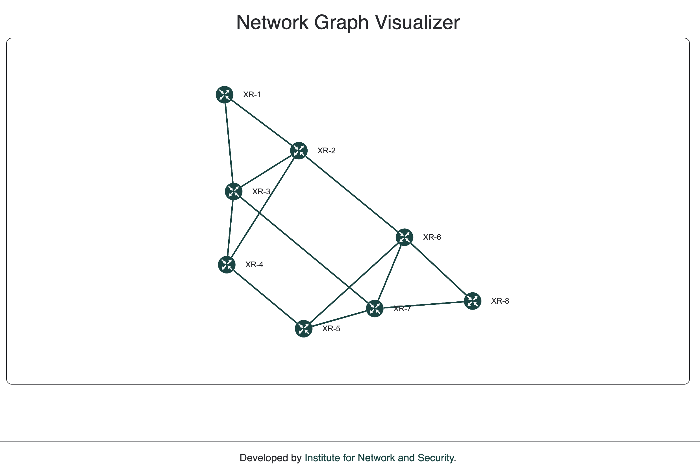

# Network Graph Visualizer

The Network Graph Visualizer is a simple application that can visualize a network topology stored in Jalapeño and access over the Jalapeño API Gateway.



## Quick navigation
* [Frontend Instructions](frontend/README.md)
* [API Instructions](api/README.md)

## Quick start
You can explore the repository using the links above.

To start the app follow these steps:
1. Set your Jalapeño API Gateway address in `api/configs/config.yml`
2. Set your API address in `frontend/src/configs/config.ts` (If you run local docker skip this step)
3. Build and start the docker containers
```
cd api/build 
docker build -t network_graph_api:latest -f Dockerfile ../
docker run -d -p 8080:8080 network_graph_api:latest
cd -

cd frontend/docker
docker build -t network_graph_frontend:latest -f Dockerfile ../
docker run -d -p 3000:3000 network_graph_frontend:latest
cd -
```
4. Navigate to http://localhost:3000